# 🧠 Post-Stroke Speech Therapy

An AI-powered Flutter application designed to assist adults recovering from post-stroke speech impairments through personalized speech therapy exercises, real-time speech analysis, and progress tracking.


---

# 📖 Overview

Stroke is one of the leading causes of speech impairment among adults, significantly affecting communication and quality of life. Traditional speech therapy often requires regular hospital visits, making rehabilitation difficult for many patients.

Post-Stroke Speech Therapy is an AI-powered Flutter application that enables stroke survivors to practice speech exercises independently while allowing therapists to monitor patient progress remotely. The application leverages TensorFlow Lite for on-device AI inference, Firebase for cloud services, and speech recognition technologies to provide real-time pronunciation and fluency feedback.

---

# 🎯 Objectives

- Improve speech rehabilitation for post-stroke patients.
- Provide personalized speech therapy sessions.
- Evaluate pronunciation and fluency using Artificial Intelligence.
- Track rehabilitation progress through detailed reports.
- Enable therapists to assign and monitor therapy sessions remotely.

---

# ✨ Features

## 👤 User Authentication

- Secure Login & Registration
- Firebase Authentication
- Patient & Therapist Roles
- Profile Management

## 🗣 Speech Therapy Exercises

- Word Repetition
- Phrase Practice
- Picture Naming
- Personalized Sessions
- Multiple Difficulty Levels

## 🤖 AI Speech Analysis

- TensorFlow Lite Speech Model
- MFCC Feature Extraction
- Speech Fluency Analysis
- Pronunciation Accuracy Scoring
- Real-time Feedback

## 📊 Progress Tracking

- Daily Reports
- Session History
- Performance Analytics
- Saved Therapy Sessions

## 👨‍⚕️ Therapist Module

- Assign Therapy Exercises
- Create Custom Sessions
- Monitor Patient Progress
- Review Exercise Results

## ☁ Firebase Integration

- Firebase Authentication
- Cloud Firestore
- Firebase Storage
- Cloud-based Synchronization

---

# 🛠 Tech Stack

| Category | Technologies |
|-----------|--------------|
| Frontend | Flutter, Dart |
| Backend | Firebase Authentication, Cloud Firestore, Firebase Storage |
| AI / ML | TensorFlow Lite, MFCC Feature Extraction, Speech Recognition |
| Tools | Android Studio, Visual Studio Code, Git, GitHub |

---

# 📂 Project Structure

```text
lib/
├── models/
├── screens/
│   ├── authentication/
│   ├── exercises/
│   ├── progress/
│   ├── patient/
│   └── therapist/
├── services/
├── utils/
└── main.dart

assets/
├── images/
│   └── img_png/
└── models/

android/
ios/
web/
linux/
macos/
windows/
```

---

# 🚀 Getting Started

## Prerequisites

- Flutter SDK
- Dart SDK
- Android Studio / VS Code
- Firebase Project
- Git

## Clone Repository

```bash
git clone https://github.com/CodeWIth-Bilall/Post-Stroke-Speech-Therapy.git
```

## Navigate to Project

```bash
cd Post-Stroke-Speech-Therapy
```

## Install Dependencies

```bash
flutter pub get
```

## Run Application

```bash
flutter run
```

---

# 📸 Application Screenshots

The following screenshots showcase the application's workflow, from authentication and role selection to AI-powered speech therapy exercises.

## Authentication

| Splash Screen | Login |
|---------------|-------|
| 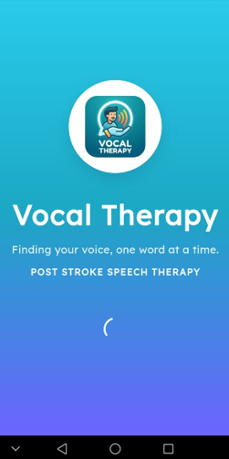 | 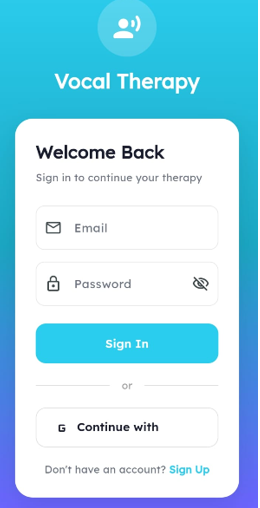 |

---

## User Roles

| Role Selection | Patient Profile |
|----------------|-----------------|
| 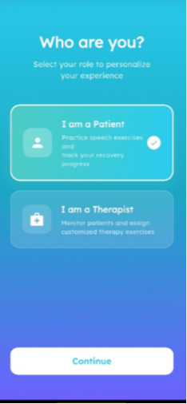 | 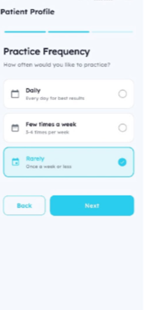 |

---

## Patient Information

| Primary Goals | Patient Dashboard Screen |
|---------------|--------------------------|
| 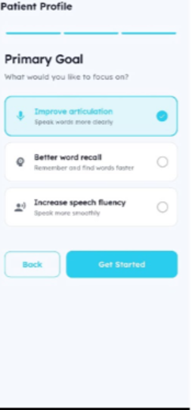 | 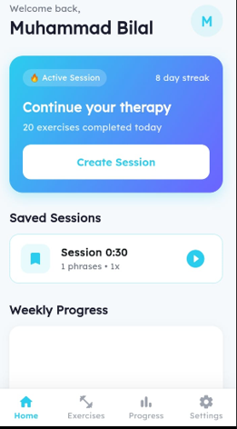 |

---

## Patient Dashboard

| Games Weekly Report | Progress | Word Repeat Exercise |
|---------------------|----------|----------------------|
| 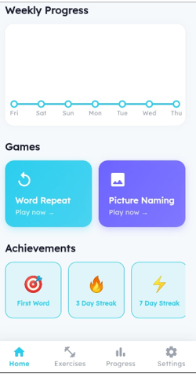 | 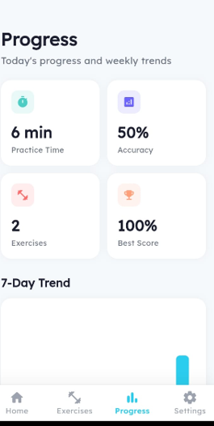 | 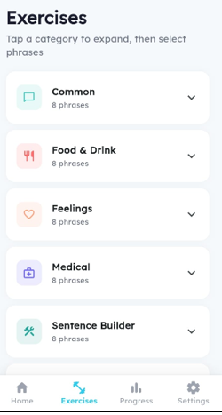 |

| Phrase Practice | Practice Screen | Picture Naming |
|-----------------|-----------------|----------------|
| 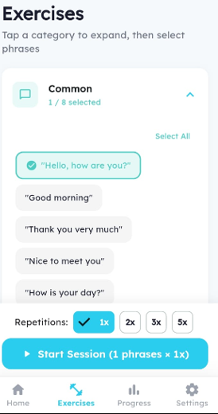 | 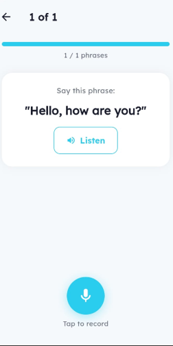 | 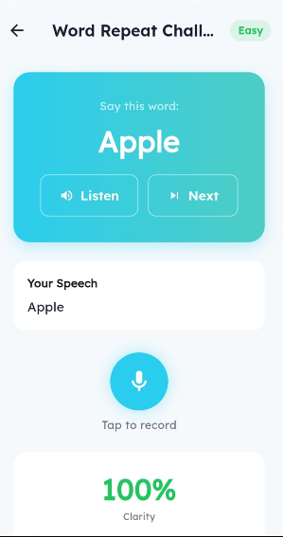 |

---

## Result

| Session Complete | Result Screen |
|------------------|---------------|
|  | 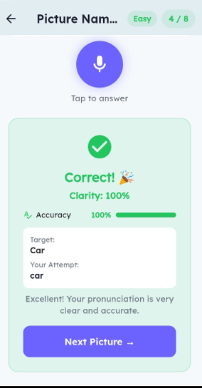 |

---

## Therapist

| Therapist Profile | Add First Patient | Patient Dashboard |
|-------------------|-------------------|-------------------|
| 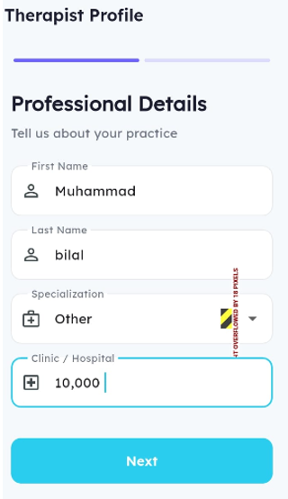 | 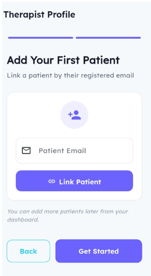 | 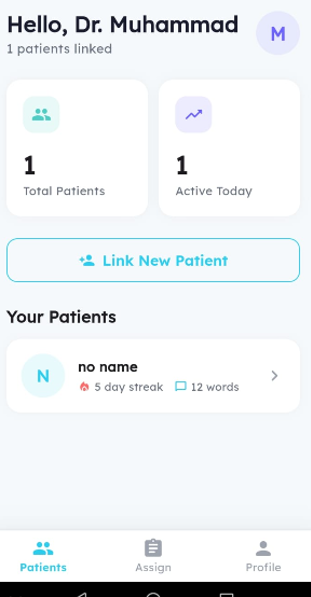 |


---

# 🤖 AI Pipeline

```text
User Speech
      │
      ▼
Speech Recording
      │
      ▼
MFCC Feature Extraction
      │
      ▼
TensorFlow Lite Model
      │
      ▼
Speech Fluency Score
      │
      ▼
Real-Time Feedback
      │
      ▼
Save Results to Firebase
```

---

# 🔮 Future Enhancements

- AI-powered pronunciation correction
- Multi-language speech support
- Therapist video consultation
- Adaptive learning recommendations
- Cloud model updates
- Advanced analytics dashboard
- Offline speech evaluation
- Voice biometrics for patient identification

---

# 👨‍💻 Team

- Muhammad Abdur Rehman
- Muhammad Bilal
- Ahmad Waseem Paracha

**Supervisor:** Mr. Imran Javed

**Department of Computer Science**

**National University of Modern Languages (NUML), Rawalpindi**

---

# 📚 Academic Information

This project was developed as the Final Year Project (FYP) for the Bachelor of Science in Computer Science (BSCS) program at the National University of Modern Languages (NUML), Rawalpindi.

---

# ⭐ Project Highlights

- ✅ Flutter Cross-Platform Mobile Application
- ✅ TensorFlow Lite AI Integration
- ✅ Firebase Authentication & Firestore
- ✅ Speech Recognition
- ✅ MFCC Feature Extraction
- ✅ Real-Time Speech Evaluation
- ✅ Therapist & Patient Modules
- ✅ Personalized Speech Therapy
- ✅ Progress Tracking Dashboard
- ✅ Git Version Control

---

# 📄 License

This project is developed for educational and research purposes as part of a university Final Year Project.

© 2026 Muhammad Abdur Rehman, Muhammad Bilal, Ahmad Waseem Paracha. All Rights Reserved.
